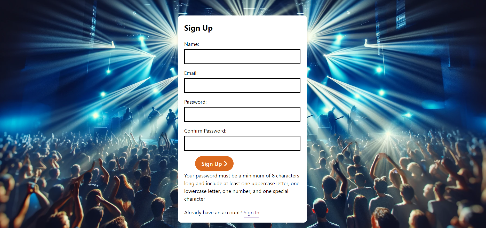
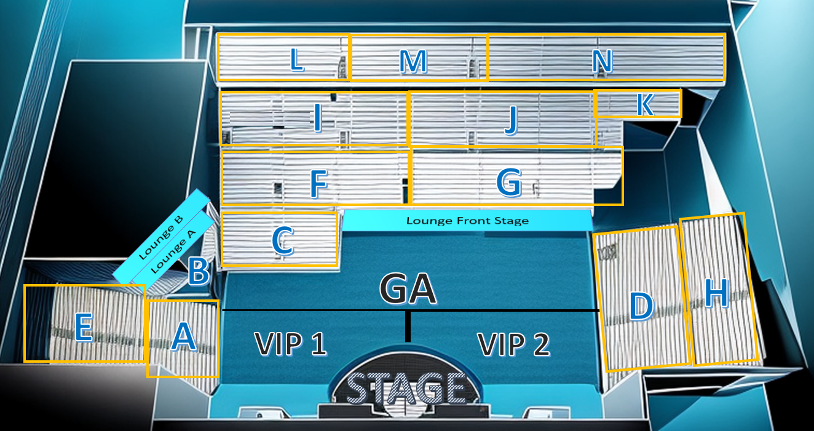

# Hi-Life Arena

## Description

Hi-Life Arena is an academic research project for the Computer Science course at Dorset College, class of 2024.

This proposal outlines the development of a ticket sales website with 3D visualization capabilities, enabling users to view available seats and the corresponding stage perspective to make informed decisions when purchasing tickets.

The project aims to improve the ticket purchasing experience by providing detailed 3D seat maps, addressing common issues faced by users with traditional flat map presentations.

Many users face difficulties in purchasing tickets online, either due to the
navigability of the website or understanding the seating map of the event venue, which is
mostly a flat map with no details.
By providing a 3D view of the event location for seat selection, it will greatly improve the
purchasing experience and align consumer expectations, who will be able to have a
clearer idea of what their seat will be like and their vision for the stage.

**Technologies Used:**
- Front-end: HTML, CSS
- 3D Modeling: SketchUp
- Back-end: JavaScript
- Database: Firebase

## Features

- 3D seat selection
- User authentication
- Real-time ticket booking system

## Visuals

## Usage

To start navigating the project:
1. Clone the repository from GitHub.
2. Open the `Login.html` file in a web browser to access the login page.
3. Follow the prompts to explore different features.

[Video Usage Demonstration on YouTube](https://youtu.be/JynRUOfu3PY) 

## Support

For any doubts or problems, please contact us at [25708@student.dorset-college.ie](mailto:25708@student.dorset-college.ie).

